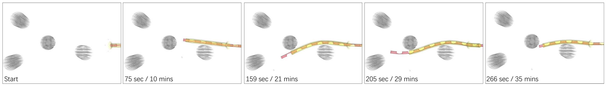
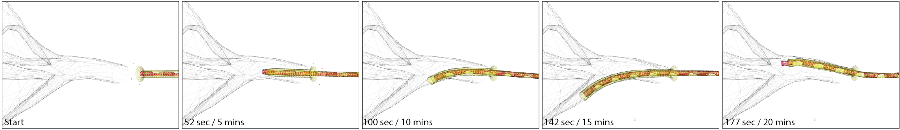

# 2022-RAL-SOFA-soft-growing-robots
Implementation of "Towards a High-Fidelity Model for Steerable Eversion Growing Robots" to appear on RA-L (Robot and Automation Letter) 2023.

Link to the paper: **Coming soon**

*Navigation scenes for different environments of our implementation of the MAMMOBOT robotic system into SOFA Framework. The first image shows a workspace forms of rigid pegs and the second image shows a navigation through the mammary duct.*

>[**Towards a High-Fidelity Model for Steerable Eversion Growing Robots**](),
>
>[Zicong Wu](https://rvim.online/author/zicong-wu/), [Mikel De Iturrate Reyzabal](https://kclpure.kcl.ac.uk/portal/en/persons/mikel-de-iturrate-reyzabal(54d8acc4-29b6-4ea6-855c-3d25077e13f4).html), [S.M.Hadi Sadati](https://rvim.online/author/s.m.hadi-sadati/), [Hongbin Liu](http://kclhammerlab.com/people/hongbin-liu/), [Sebastien Ourselin](https://www.kcl.ac.uk/people/sebastien-ourselin), [Daniel Leff](https://www.imperial.ac.uk/people/d.leff), [Robert K.Katzschmann](https://srl.ethz.ch/the-group/prof-robert-katzschmann.html), [Kawal Rhode](https://kclpure.kcl.ac.uk/portal/kawal.rhode.html), [Christos Bergeles](https://rvim.online/author/christos-bergeles/)
>
>*RA-L 2023 ([paper]())*

## Log
* Added latest mesh and physical parameters of the soft growing robot
* Added the presentation for the [SOFAWeek2022](SofaWeek2022/SOFAWeek2022.pdf)
* Soon: Video with the presentation at SOFAWeek2022, link to the paper and citation

## Requirements
The plugin requires to build [SOFA](https://www.sofa-framework.org/) from source code. The plugin has been tested in both Linux (Ubuntu 18.04/20.04) and Windows 10 platform. To install SOFA from source follow the instructions on their webpage for [Linux](https://www.sofa-framework.org/community/doc/getting-started/build/linux/) or [Windows](https://www.sofa-framework.org/community/doc/getting-started/build/windows/). We recomend to use clang and ninja to accelerate the compilation in Linux. For Windows 10 compilation, we use Visual Studio 2019.

During the compilation in the CMake-GUI you need to add the [SofaPython3 plugin](https://sofapython3.readthedocs.io/en/latest/), no need to install anything as you have the option to fetch SofaPython3 directly during compilation. Follow the [instructions](https://sofapython3.readthedocs.io/en/latest/menu/Compilation.html) on their webpage to add the plugin. It requires you to install extra dependencies such as [pybind11](https://pybind11.readthedocs.io/en/stable/) and Python <=3.8 + numpy + scipy, already installed for SOFA.

**Summary**:

1. Compile SOFA from source code, we recommend the latest stable version from SOFA (current v22.06 by Nov 22)
1. Fetch and add the SofaPython3 plugin on the CMake-Gui
1. Follow the instructions on the [README](SofaMAMMOBOT/README.md) to add the **SofaMAMMOBOT** plugin
1. Configure and generate the project
1. Compile SOFA and type runSofa on the terminal to check that the installation is successful

## Plugin
All the necessary scripts for the plugin are within the *[SofaMAMMOBOT](SofaMAMMOBOT/)* folder.
To use the plugin refer to the [Instructions](SofaMAMMOBOT/README.md) file on the internal folder.

## License and copyright
Please see the [LICENSE](LICENSE) file for details.

## Acknowledgment
This project utilizes [SOFA](https://www.sofa-framework.org/) and the official plugin of [SofaPython3](https://sofapython3.readthedocs.io/en/latest/). We thank the authors of those projects for open-sourcing their code.

## Citation
If you found the paper of code useful please cite the following:

**Coming soon**

